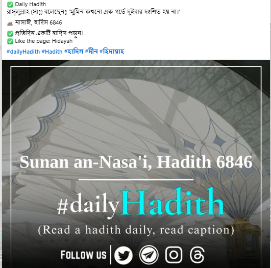
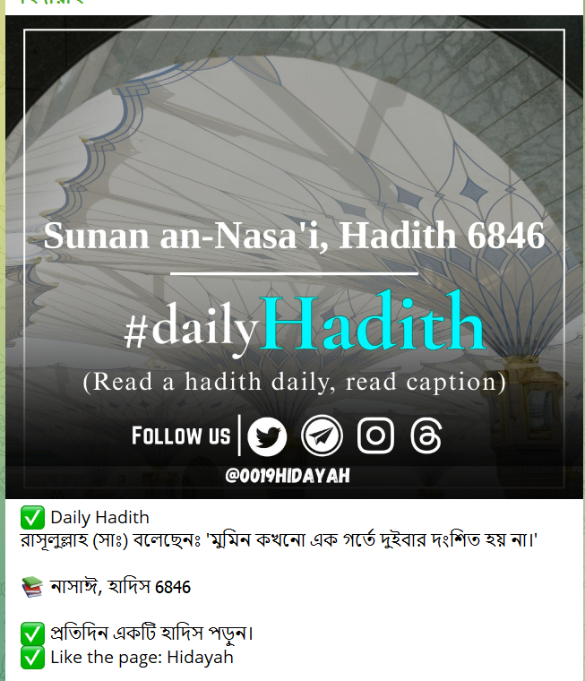
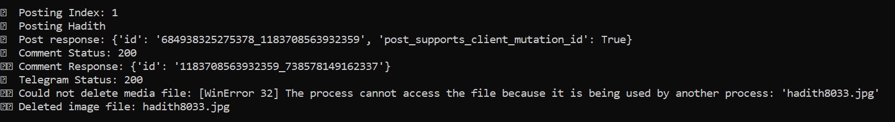
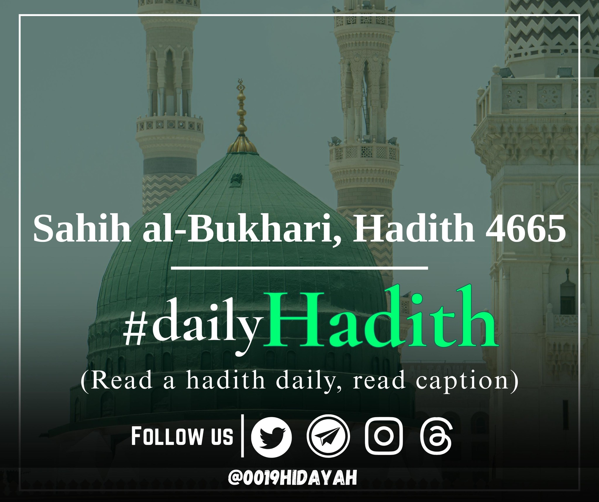

# 🕌 Islamic Auto Post Bot

A Python automation bot that posts Quran Ayahs, Hadiths, Islamic Q&A, and Quran Recitation videos to your **Facebook Page** and **Telegram Channel** every hour — fully automatically.

---

## ✨ Features

- ✅ Posts random **Quran Ayahs** with beautifully designed backgrounds
- ✅ Shares authentic **Hadiths** with book name and number
- ✅ Publishes **Islamic Q&A** from your dataset
- ✅ Generates **Quran recitation videos** using `moviepy` and overlays
- ✅ Posts to both **Facebook Page feed** and **Telegram Channel**
- ✅ Runs on an hourly **automated loop**
- ✅ Supports custom background images and fonts
- ✅ Privacy policy and data deletion pages ready for Meta App review

---

## 📂 Project Structure

| File | Description |
|------|-------------|
| `main_bot.py` | Posts Quran, Hadith, and Q&A with image creation and Facebook + Telegram integration |
| `recitation_bot.py` | Handles Quran Recitation video generation, posting, and automation loop |
| `privacy-policy.html` | Your privacy policy page for Meta App |
| `data-deletion.html` | User data deletion instructions for Meta App |
| `requirements.txt` | Python dependencies |
| `README.md` | Project overview |

---

## 📦 Dependencies

Install all required packages:
pip install -r requirements.txt

⚙️ Usage Instructions
Clone the repo:

git clone https://github.com/sshahadat1294/islamic-auto-post-bot.git
cd islamic-auto-post-bot
Add your credentials:

Facebook Page ID

Page Access Token

Telegram Bot Token

Telegram Channel ID

Add your background images and font files to the folder:

Q1.png, h1.png, qa1.png, etc.

Tinos-Bold.ttf, SutonnyMJ.ttf, Amiri-Regular.ttf

Prepare your content files:

hadiths_bn_fixed.json

ifatwa_data_cleaned.json

Quran audio in the quran_audio folder

Recitation base videos: r1.mp4 and r2.mp4

Run the bot:
python recitation_bot.py
This will post Quran Recitation → Hadith → QA → Ayah → (repeat every hour)

### 📸 Screenshots

**Facebook Post Example**  

**Telegram Bot Preview**  

**Console Output**  

**Quran Image Demo**  

**Hadith Image Demo**  

🔐 Meta App Compliance
✅ Privacy Policy: View

✅ Data Deletion: View

🤝 Contribution
Pull requests and improvements are welcome. Please ensure all data and quotes are authentic and respectful to Islamic teachings.

📬 Contact
For setup help or contributions:

📧 shahriar1294.shahadat@gmail.com
🌐 (https://www.facebook.com/shahriar.shahdat)

🪪 License
MIT License – free to use, modify, and share with attribution.

May Allah accept our efforts to spread authentic knowledge. 🤲
---
